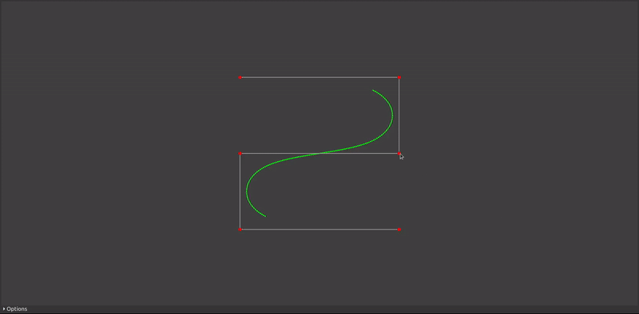

# Лабораторные работы и курсовая работа

## по курсу "Компьютерная графика"

Студент: Инютин М. А.

Группа: М8О-307Б-19

Преподаватель: Морозов А. В.

### Курсовая работа

**Поверхность вращения. Образующая --- NURBS кривая 4-го порядка.**

### Лабораторная работа №1

Построение графика функции

**Вариант:** Степенная функция в полярных координатах

### Лабораторная работа №2

Визуализация выпуклого многогранника

**Вариант:** Прямая правильная призма

### Лабораторная работа №3

Простая модель затенения

**Вариант:** Шаровой сектор

### Лабораторные работы №4-5

Технология OpenGL, буфер вершин, шейдеры

### Лабораторная работа №6

Шейдерный анимационный эффект

**Вариант:** Анимация источника рассеянного света

### Лабораторная работа №7

Построение плоских полиномиальных кривых

**Вариант:** Равномерный кубический B-сплайн

